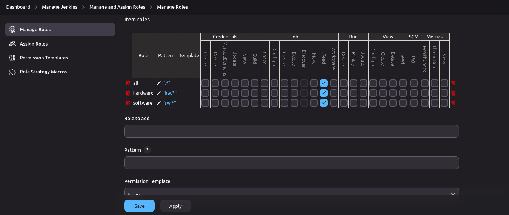
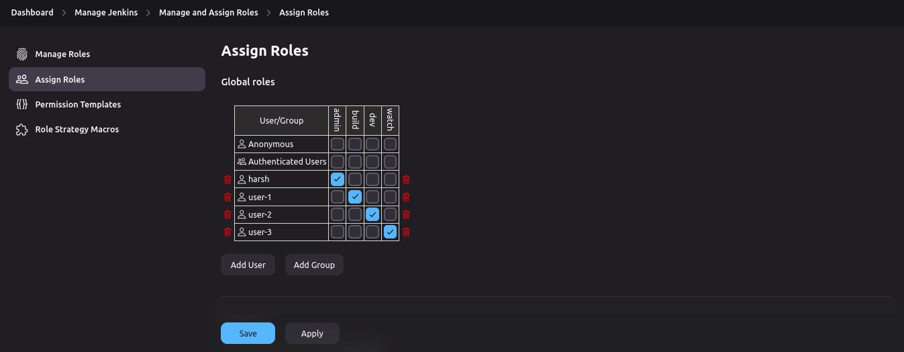

# Jenkins User and Role Management

This guide explains how to manage user roles and permissions in Jenkins using the **Role-based Authorization Strategy** plugin.

## Requirements and Setup

1. **Install the Jenkins Plugin:**
   - Plugin name: **Role-based Authorization Strategy**
   
2. **Activate the Plugin:**
   - Navigate to: **Manage Jenkins** -> **Security** -> **Authorization**
   - Select the option: **Role-Based Strategy**
   
   

## Manage Roles

Roles are used to define the level of access granted to users within Jenkins.

### 1. Global Roles

Global roles define what access users have across the entire Jenkins instance.

| **Role**  | **Access Description**                                  |
|-----------|---------------------------------------------------------|
| `admin`   | Full access to all Jenkins features and configurations. |
| `build`   | Limited to building and canceling jobs.                 |
| `dev`     | Can build, cancel, configure, and delete jobs.          |
| `watch`   | Read-only access to view job builds and logs.           |

   

### 2. Item Roles

Item roles define access to specific jobs based on job naming patterns.

| **Role**    | **Pattern** | **Access Description**                       |
|-------------|-------------|----------------------------------------------|
| `all`       | `.*`        | Access to all jobs in Jenkins.               |
| `hardware`  | `hw.*`      | Access to jobs starting with the prefix `hw`.|
| `software`  | `sw.*`      | Access to jobs starting with the prefix `sw`.|

   

## Assign Roles

Once roles are defined, you can assign them to users to control their access.

### 1. Assign Global Roles

Global roles determine what actions a user can perform across Jenkins.

| **User**   | **Role** | **Access Description**                           |
|------------|----------|--------------------------------------------------|
| `harsh`    | `admin`  | Full access to all Jenkins features.             |
| `user-1`   | `build`  | Can build and cancel jobs.                       |
| `user-2`   | `dev`    | Can build, cancel, configure, and delete jobs.   |
| `user-3`   | `watch`  | Can only view build logs.                        |

   

### 2. Assign Item Roles

Item roles define which specific jobs a user has access to, based on naming patterns.

| **User**   | **Job Access**                               |
|------------|----------------------------------------------|
| `user-1`   | Access to all hardware jobs (`hw.*`).        |
| `user-2`   | Access to both hardware and software jobs (`hw.*` and `sw.*`). |
| `user-3`   | Access to all software jobs (`sw.*`).        |

   

---
## Final Results

### User 1:

- **Job Access:** All hardware jobs (jobs with the prefix `hw`).
- **Role Access:** `BUILD` access (can build and cancel jobs).

   
   

### User 2:

- **Job Access:** All hardware and software jobs (jobs with prefixes `hw` and `sw`).
- **Role Access:** `DEV` access (can build, configure, cancel, and delete jobs).

   
   

### User 3:

- **Job Access:** All software jobs (jobs with the prefix `sw`).
- **Role Access:** `WATCH` access (can view job logs only).

   
   

---
